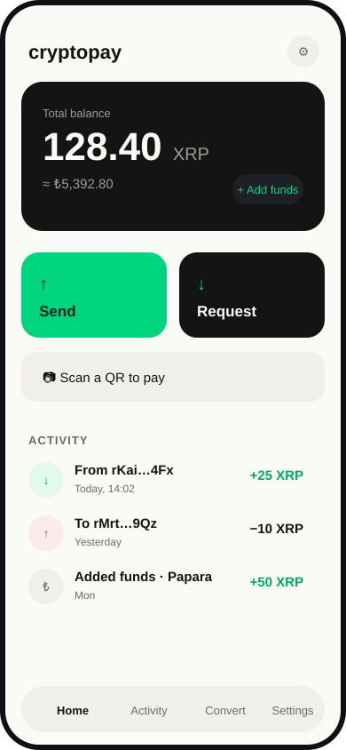
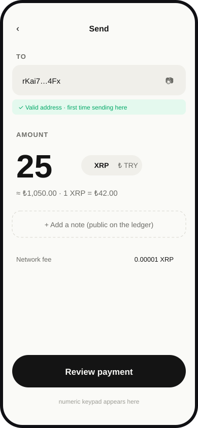
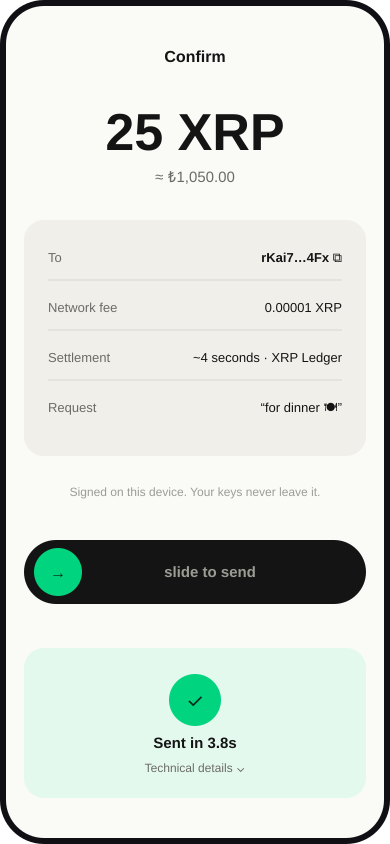
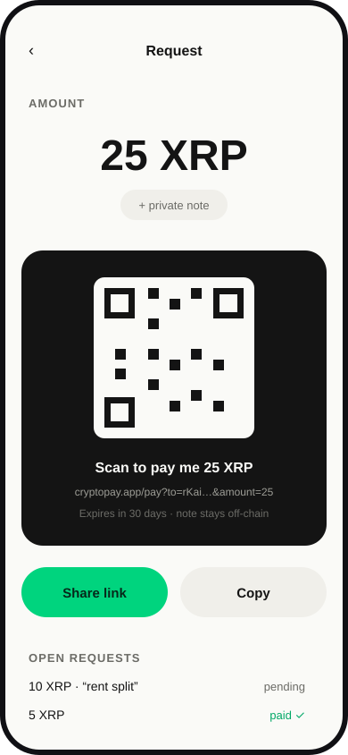

# CryptoPay — UI Design System & Rationale
### Design documentation for the privacy-driven money transfer experience

**Version:** 1.0 · **Date:** 2026-07-28 · **Companion doc:** `docs/PRODUCT_PLAN.md`

---

## Table of Contents

1. [Design Philosophy](#1-design-philosophy)
2. [Why the Current UI Must Go](#2-why-the-current-ui-must-go)
3. [Visual Identity](#3-visual-identity)
4. [Design Tokens](#4-design-tokens)
5. [Screen Designs](#5-screen-designs)
6. [Component Language](#6-component-language)
7. [Copy & Voice](#7-copy--voice)
8. [Motion & Feedback](#8-motion--feedback)
9. [Accessibility](#9-accessibility)
10. [Privacy as a Design Surface](#10-privacy-as-a-design-surface)
11. [Implementation Notes](#11-implementation-notes)

---

## 1. Design Philosophy

The product promise is *"send money, smooth as fuck, with crypto — privately."*
The design system exists to make that promise tangible. Four commitments,
in priority order:

**1. One decision per screen.**
Every screen asks the user for exactly one thing: an address, an amount, a
confirmation. The moment a screen presents two equal-weight choices, we have
failed. This is the single biggest lever for "smooth": speed comes from never
making the user think, not from making animations fast.

**2. The blockchain is plumbing.**
No hashes, no ledgers, no "XRP Ledger testnet", no EscrowCreate on the happy
path. Technical truth stays available — one layer down, behind a "details"
disclosure — because hiding information entirely would break trust for power
users. The rule: *mainstream words on the surface, verifiable truth one tap
away.*

**3. Trust is designed, not claimed.**
Money apps earn trust through calm: stable layouts, no visual noise, exact
numbers, fees shown *before* the commit, and a confirmation that reads like a
receipt. We deliberately avoid the visual language of casinos and trading
apps (flashy gradients, pulsing CTAs, red/green tickers everywhere).

**4. Privacy you can see.**
Privacy is usually invisible — that's a marketing problem. We surface it as
small, concrete statements at the exact moment they matter: "Signed on this
device. Your keys never leave it." on the confirm screen; "public on the
ledger" next to the note field. Privacy becomes a felt product feature.

---

## 2. Why the Current UI Must Go

Honest audit of the existing interface:

| Current pattern | Why it fails the product |
|---|---|
| Purple-blue gradient background (`#667eea → #764ba2`) | Generic 2018-fintech. Reads as "template", not "product". Gradients-as-decoration add no information. |
| Wallet management as the home screen | The first thing a new user sees is key management — the scariest part of crypto. It frames the app as a tool for experts. |
| Six equal tabs (Wallet / Payment / Request / Scanner / Dashboard / P2P) | Six equal choices = no product opinion. The user must understand the whole system before doing anything. |
| Raw `r...` addresses as primary identifiers | Humans don't send money to 34-character strings. This alone makes the app unusable for its purpose. |
| Exchange vocabulary (order book, matching, escrow status) on user screens | Correct for the rail, wrong for the user. |
| `window.prompt` for passwords | A browser chrome dialog inside your security flow signals "prototype". |
| Card-inside-card layouts with heavy shadows | Visual noise that competes with the numbers, which are the content. |

Nothing here is a criticism of the engineering underneath — the hardened
backend stays. This is a **reskin and re-orchestration**, not a rewrite.

---

## 3. Visual Identity

### 3.1 The idea: "paper & ink, one signal"

The identity is built on a metaphor: **a paper receipt and a fountain pen,
with one electric signal color.** Paper = calm, money, receipts, analog trust.
Ink = finality, signatures, precision. The signal green appears only when the
app wants to tell you something: money arrived, an address is valid, a button
is the way forward.

This is a deliberate departure from both crypto aesthetics (dark neon,
gradient meshes) and bank aesthetics (navy + gold). A privacy product should
look *quiet and certain*, not exciting.

### 3.2 Color

| Token | Value | Role |
|---|---|---|
| `paper` | `#FAFAF7` | App background. Warm off-white — pure white feels clinical; the warmth keeps it human. |
| `ink` | `#141414` | Primary text, primary surfaces (balance card, CTA). Near-black; softer than `#000`, higher contrast than any gray for numbers. |
| `ink-soft` | `#6B6B66` | Secondary text, labels, timestamps. Warm gray matching the paper. |
| `ink-faint` | `#9C9C95` | Tertiary text, placeholders, microcopy. |
| `surface` | `#F0EFEA` | Input fields, list chips, inactive states. A tint of the paper, not a new hue — keeps the palette to one family. |
| `signal` | `#00D47E` | **The only hue.** Money received, success, valid state, primary accent. An electric green that reads "alive" against both paper and ink. |
| `signal-deep` | `#00A866` | Signal text on light backgrounds (meets contrast). |
| `signal-wash` | `#E4F9EE` | Success backgrounds, received-amount chips. |
| `danger` | `#D44747` | Destructive actions, outgoing-money arrows. Used sparingly and never decoratively. |
| `danger-wash` | `#FBEAEA` | Background for destructive/warning chips. |

**Why one hue:** restraint is the identity. When everything is colorful,
nothing communicates. With exactly one signal color, color itself becomes
information — green *means* something every time it appears.

### 3.3 Typography

- **Stack:** `-apple-system, "SF Pro", "Segoe UI", Roboto, "Helvetica Neue", sans-serif`.
  System fonts, deliberately: zero webfont downloads (privacy — no third-party
  font CDN seeing requests; performance — instant render; platform-native
  feel).
- **The numerals are the brand.** Money apps are read, not viewed. Balance
  and amounts use large, tight, tabular-feeling numerals (weight 700, sizes
  44–64px). The biggest thing on any screen is always the number that matters.
- **Scale:** 64 / 44 (hero amounts) · 22 (wordmark) · 17–20 (actions) ·
  15–16 (body) · 13 (labels, uppercase, 0.08em tracking) · 12 (microcopy).
- **Labels in small-caps gray** (`TO`, `AMOUNT`, `ACTIVITY`) — form-like,
  receipt-like, and they let the values dominate.

### 3.4 Shape & space

- **Radius 16–32px, always generous.** Fully-rounded (32px) for the primary
  CTA — a "pill" is pressable in a way a rectangle isn't. 20–24px for cards.
- **No decorative shadows.** One soft elevation maximum; separation comes from
  tone (paper/surface/ink), not from stacked drop shadows.
- **Spacing on an 8px grid**, with big air around numbers (32px+). Density is
  low on purpose: a money app should feel unhurried.

### 3.5 Iconography & imagery

- Plain Unicode arrows (↑ sent / ↓ received) and minimal glyphs, not emoji
  art or illustration packs. Icons are functional labels, never decoration.
- The only "illustration" in the system is the QR code itself — which we
  treat as a designed object (framed, centered, given a caption) because it
  *is* the product in that moment.

---

## 4. Design Tokens

Drop-in tokens for the styled-components theme:

```js
const theme = {
  color: {
    paper:      '#FAFAF7',
    ink:        '#141414',
    inkSoft:    '#6B6B66',
    inkFaint:   '#9C9C95',
    surface:    '#F0EFEA',
    line:       '#D8D7D0',
    signal:     '#00D47E',
    signalDeep: '#00A866',
    signalWash: '#E4F9EE',
    danger:     '#D44747',
    dangerWash: '#FBEAEA',
  },
  font: {
    stack: `-apple-system, "SF Pro", "Segoe UI", Roboto, "Helvetica Neue", sans-serif`,
    hero:   '700 64px/1.05',
    amount: '700 44px/1.1',
    title:  '600 16px/1.3',
    body:   '400 15px/1.5',
    label:  '600 13px/1.2',  // + text-transform: uppercase, letter-spacing: 0.08em
    micro:  '400 12px/1.4',
  },
  radius: { card: 20, input: 16, pill: 32, sheet: 24 },
  space:  n => `${n * 8}px`,
  motion: { fast: '120ms ease-out', med: '220ms ease-out' },
};
```

Dark mode: invert to `ink`-as-background / `paper`-as-text later — the
two-tone system inverts cleanly. Not in the first pass (mobile PWA first,
light default).

---

## 5. Screen Designs

Mockups are code-drawn SVG (source of truth, pixel-exact) with PNG previews:

| Screen | SVG | Preview |
|---|---|---|
| Home | `docs/design/01-home.svg` | `docs/design/01-home.png` |
| Send | `docs/design/02-send.svg` | `docs/design/02-send.png` |
| Confirm | `docs/design/03-confirm.svg` | `docs/design/03-confirm.png` |
| Request | `docs/design/04-request.svg` | `docs/design/04-request.png` |

### 5.1 Home — "your money and two buttons"



- **Black balance card first.** The single most important fact — what do I
  have — gets the highest-contrast surface in the app. The ₺ equivalent sits
  under it at half emphasis: both are true, one is primary.
- **Two actions, asymmetric.** Send is the signal-green filled tile; Request
  is ink. Not 50/50 gray twins — the app has an opinion about what you came
  to do. "+ Add funds" lives inside the balance card (contextually where the
  money is), not as a third peer action.
- **Scan is a row, not a tab.** It's a tool you use on the way to Send, so it
  looks like one.
- **Activity as a receipt list.** Received = green ↓ and `+amount`; sent =
  red ↑ and `−amount`; on-ramp = neutral ₺ glyph. Counterparties shown as
  truncated addresses (`rKai…4Fx`) — honest identifiers without pretending we
  know names. Client-side labels ("Ahmet") can layer on later without
  changing the layout.
- **Tab bar, four items, Home first.** Convert (the P2P rail) and Settings
  are reachable but not loud.

### 5.2 Send — "one vertical thought"



- **Top-to-bottom reading order = the task order:** who → how much →
  (optional note) → review. No tabs, no side panels.
- **The amount is enormous** (64px) and the currency toggle (XRP/₺ TRY) sits
  *next to it* as a segmented pill — because "how much" is the user's mental
  model and TRY is how they think. The app converts; the user shouldn't.
- **Validation is a green sentence**, not a red border: "✓ Valid address ·
  first time sending here" — confirming correctness *and* quietly warning
  about novelty (a real anti-fraud cue) in one line.
- **The note field is dashed and carries its warning inline** ("public on the
  ledger") — opt-in affordance and privacy education fused into one element
  (§10).
- Numeric keypad is the expected input (mobile-first); desktop falls back to
  a standard input with the same layout.

### 5.3 Confirm — "the receipt before the fact"



- **Structured like a receipt:** hero amount, then a detail card of
  label/value rows (To, Network fee, Settlement, Request note). Receipts are
  the most trusted document format in money — borrowing their grammar makes
  the screen instantly legible.
- **Fee is shown, always, even when trivial** (0.00001 XRP). Hiding small
  numbers teaches users that numbers are sometimes hidden.
- **The privacy line sits directly above the commit control:** "Signed on
  this device. Your keys never leave it." — placed where reassurance affects
  the decision, not in an About page nobody reads.
- **Slide-to-send**, not a button: a deliberate motor action that prevents
  accidental taps on the one irreversible action in the app, and feels like
  "signing". (Desktop: hold-to-confirm button with the same semantics.)
- **Success is a state of the same screen**, not a navigation event: green
  wash, check, "Sent in 3.8s" — speed itself is shown as a feature.
  "Technical details ⌄" reveals the tx hash for verification without
  cluttering the moment.

### 5.4 Request — "the QR is the product"



- **After entering an amount, the output is one black card with the QR
  centered** — the artifact gets a stage. Under it, in priority order: what
  it does ("Scan to pay me 25 XRP"), the shareable link (truncated), and the
  two lifecycle facts ("Expires in 30 days · note stays off-chain").
- **Two share actions, asymmetric again:** "Share link" is signal (the common
  case — remote), "Copy" is neutral. In-person is handled by the QR itself.
- **"Private note" is a pill, and the card states where it lives** —
  repeating the privacy rule at the point of use.
- **Open requests list below** with pending/paid states, so the screen is
  also the tracking surface — no separate "my requests" tab.

### 5.5 What was deliberately left out of these screens

- No price charts, no tickers, no % change badges — this is a transfer app,
  and trading-UI furniture invites trading behavior.
- No avatars, no contact photos — we don't have identities, and fake
  placeholders would lie about that.
- No badges/gamification/notifications dots — calm is the brand.

---

## 6. Component Language

| Component | Spec | Why |
|---|---|---|
| **Balance card** | Ink surface, 24px radius, hero numeral + fiat sub-line + contextual action | The "what do I have" answer deserves maximum contrast. |
| **Action tile** | 164×96, 20px radius, arrow glyph + verb | Big touch targets; arrows carry direction meaning (↑ out, ↓ in) that works across languages. |
| **Input row** | Surface fill, 16px radius, 60px tall, 15px text | Reads as "form on paper"; filled fields outperform outlined ones on mobile. |
| **Validation line** | Sentence-style, signal-wash bg, 12px | Feedback as prose — "✓ Valid address · first time sending here" — is friendlier and more informative than color alone. |
| **Segmented toggle** | Pill container, two options, active = ink on paper | For XRP/₺ and any binary choice; avoids dropdown friction. |
| **Detail rows** | Label left (inkSoft) / value right (ink), hairline separators | Receipt grammar; the eye scans label→value pairs effortlessly. |
| **Primary CTA** | Full-width pill, ink bg, 17px/600 | One per screen. If two are needed, one is demoted to neutral. |
| **Slide-to-confirm** | Ink track + signal knob | Reserved exclusively for irreversible money movement — its rarity is what makes it meaningful. |
| **Status chip** | Text + wash background (signal/danger/surface) | Order/request states; never icon-only (accessibility). |
| **Bottom sheet** | 24px top radius, paper bg, drag handle | Home for Scan, Settings, Unlock — keeps context (no full-page navigations for sub-tasks). |
| **Unlock modal** | Sheet with password field + biometric-ready layout | Replaces `window.prompt`; same component gates unlock, export, and signing. |

---

## 7. Copy & Voice

The interface speaks like a competent friend, never like a terminal and never
like a salesperson.

| Situation | We say | We never say |
|---|---|---|
| Send success | "Sent in 3.8s" | "Transaction validated by consensus" |
| Fee | "Network fee 0.00001 XRP" | "Gas" / "commission" |
| New recipient | "First time sending here" | "Unverified counterparty" |
| Unfunded recipient | "This wallet is new — the first payment must be at least 10 XRP (a network rule)" | "actNotFound: base reserve violated" |
| Memo field | "+ Add a note (public on the ledger)" | "Memo (optional)" |
| Privacy reassurance | "Signed on this device. Your keys never leave it." | "We take security seriously" |
| Failure | "Payment didn't go through — nothing was sent. Try again?" | "tecPATH_PARTIAL" / raw engine results |

Rules: numbers are always exact; errors always state whether money moved;
network rules are attributed to the network ("a network rule"), not hidden;
the word "wallet" is preferred over "account" (accurate and non-bank).

---

## 8. Motion & Feedback

Motion is restrained by policy — it exists to explain state changes, not to
entertain:

- **Screen transitions:** 220ms ease-out slides for forward/back navigation
  (standard iOS-style). Nothing bounces.
- **Commit feedback:** slide-to-confirm knob snaps on release; the success
  check draws itself (stroke animation, 300ms). One flourish maximum per
  flow, and it's earned (money moved).
- **Balance changes** tick (count animation, 400ms) when Activity brings a
  new receipt — the one place motion *is* the message.
- **No skeleton spinners for XRPL settlement:** the confirm screen shows
  "Sending…" → "Sent in Xs" as a state change with elapsed time, because
  ~4s is short enough to watch and the elapsed time is a feature.
- **Pull-to-refresh** on Home/Activity; **no autoplaying anything**.

---

## 9. Accessibility

- **Contrast:** ink-on-paper 15.8:1; signalDeep-on-paper 3.1:1 (used only at
  ≥13px bold, AA for large text); all body pairs pass WCAG AA.
- **Never color-only:** direction is arrow + sign + word; status is chip text;
  validation is a sentence. A monochrome render of every screen loses no
  information.
- **Touch targets ≥ 44pt**; the two Home tiles are 164×96px.
- **Dynamic type:** layouts are flow-based (no fixed-height text containers);
  hero amounts scale down gracefully at 200% text size.
- **Screen readers:** amounts announced with currency ("25 X R P,
  approximately 1050 Turkish lira"); slide-to-confirm has a button-equivalent
  accessibility action.
- **Reduced motion:** all animation honors `prefers-reduced-motion` (states
  change instantly, check draws skipped).

---

## 10. Privacy as a Design Surface

Design decisions whose *primary* purpose is the privacy promise:

1. **Microcopy at decision points** (§5.3, §5.4): the privacy properties are
   stated where they affect behavior, in 6–10 words, not in a policy page.
2. **The note/memo split is structural**: one field that is public-on-ledger
   (visually marked, dashed, off by default) and one that is app-private
   (pill, "stays off-chain"). The UI *is* the privacy documentation.
3. **No identity furniture:** no avatar placeholders, no name fields, no
   "complete your profile" prompts. The absence is deliberate and visible.
4. **Expiry stated on artifacts**: "Expires in 30 days" on every request —
   data minimization made tangible.
5. **Truncated addresses with copy control** (`rKai…4Fx ⧉`): full strings
   appear only where verification demands them (confirm screen, details).
6. **No third-party pixels**: system fonts, self-hosted or pinned+SRI
   scripts, no analytics — the network tab is part of the design.

---

## 11. Implementation Notes

- **Stack stays:** React 18 + styled-components + react-toastify (toasts
  restyled to tokens). The theme object (§4) is the single source; existing
  components adopt it screen by screen as the flows in `PRODUCT_PLAN.md` §9
  are built (M1–M3).
- **Mockups are SVG source** (`docs/design/*.svg`) — pixel-exact, diffable in
  code review, and the same coordinate space (390×844, iPhone 14 class) the
  mobile-first CSS targets. PNGs are previews only; edit the SVGs.
- **Desktop behavior:** the phone-first layout centers in a max-width 480px
  column on desktop — a money app that is honest about being mobile-first,
  rather than stretching cards across 1200px.
- **Build order matches the product plan:** Home/Send/Confirm first (M1),
  then Request/links (M2), then polish (M3) — each milestone ships a
  coherent, usable product, not a half-skinned one.

---

*Design direction and rationale: synthesized from the product principles in
`docs/PRODUCT_PLAN.md` (smooth, privacy-driven, rail-invisible). Every choice
above is argued from those principles rather than from trend — if a future
change can't be traced back to a principle, it doesn't belong in the system.*
